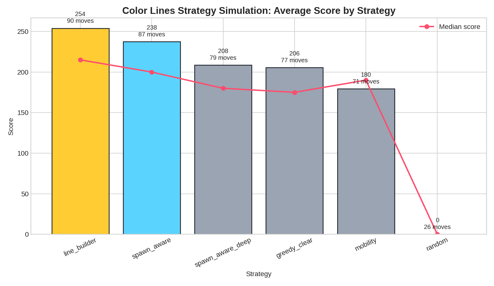

# Практически оптимальная стратегия Color Lines

**Автор:** Manus AI  
**Дата:** 11 мая 2026  
**Проект:** `colorlines-game`

## Краткий вывод

По результатам симуляции лучшим практическим режимом игры стала стратегия **`line_builder`**: она набрала самый высокий средний счёт — **254 очка** за 10 партий, а также дала наибольшую среднюю продолжительность партии — **90,5 хода**. Это означает, что в текущих правилах Color Lines выгоднее не просто держать поле свободным и не только забирать ближайшую очистку, а системно строить будущие линии: создавать открытые цепочки из 3–4 шаров одного цвета, сохранять для них свободные окончания и выбирать ходы, которые одновременно улучшают несколько направлений.

Вторая важная стратегия — **`spawn_aware`**. Она немного уступила по среднему счёту, но показала лучший максимум — **560 очков**. Это говорит о том, что учёт следующих трёх цветов может давать сильные партии, особенно когда игрок умеет готовить поле под вероятное появление новых шаров. В практической игре это стоит использовать как дополнительное правило выбора: сначала стройте линии, затем среди близких по качеству ходов выбирайте тот, который лучше принимает следующие цвета.

## Результаты симуляции

Эксперимент запускался на симуляторе `scripts/colorlines_strategy_sim.mjs`. В каждой стратегии было сыграно по 10 детерминированных партий с одинаковой последовательностью seed-ов. Все стратегии играли по текущим правилам проекта: поле 9×9, 7 цветов, линия очищается от 5 шаров, после обычного хода появляются 3 новых шара, а начисление очков соответствует формуле `count * 2 + max(0, count - 5) * 3`.

| Стратегия | Партий | Средний счёт | Медиана | P90 | Максимум | Среднее число ходов | Средне пустых клеток перед ходом | Средне легальных ходов перед ходом | Game Over |
|---|---:|---:|---:|---:|---:|---:|---:|---:|---:|
| **line_builder** | 10 | **254.0** | 215 | 360 | 405 | **90.5** | 39.4 | 660 | 100% |
| spawn_aware | 10 | 237.5 | 200 | 350 | **560** | 86.6 | 40.3 | 651 | 100% |
| spawn_aware_deep | 10 | 208.5 | 180 | 320 | 400 | 78.7 | 40.4 | 662 | 100% |
| greedy_clear | 10 | 205.5 | 175 | 310 | 355 | 76.7 | 39.7 | 626 | 100% |
| mobility | 10 | 179.5 | 190 | 225 | 290 | 70.8 | 38.6 | **700** | 100% |
| random | 10 | 0.0 | 0 | 0 | 0 | 26.0 | 38.5 | 514 | 100% |

> **Интерпретация:** `line_builder` оказался самым стабильным режимом, потому что он оценивает не только немедленную очистку, но и позиционный потенциал поля: почти готовые пятёрки, длинные одноцветные цепочки, соседство одинаковых цветов, свободные клетки и связность пустого пространства. Метрики контроля поля показывают важную деталь: `mobility` имела больше всего легальных ходов перед ходом — около **700**, но всё равно набрала меньше очков. Значит, мобильность полезна как ограничение безопасности, но не должна быть главным критерием; её нужно подчинять строительству линий. `spawn_aware` иногда выигрывает за счёт удачного использования следующих цветов, но его преимущество менее стабильно на малой выборке.

## Что именно означает стратегия `line_builder`

Суть стратегии — играть не «от шара к шару», а **от будущей линии к текущему ходу**. Каждый ход должен отвечать на вопрос: «какую линию из пяти я приближаю и останется ли у неё место для завершения?» В симуляторе эта стратегия получала высокий вес за немедленную очистку, за позиции 4+1, 3+2 и 2+3 в окнах длиной пять клеток, за максимальную длину текущих цепочек, за соседство одинаковых цветов и за сохранение пустых клеток.

| Приоритет | Что делать | Почему это работает |
|---|---|---|
| 1 | **Забирать готовую линию**, если ход сразу очищает 5+ шаров. | Очистка не добавляет новые 3 шара после хода, поэтому она одновременно даёт очки и снижает давление на поле. |
| 2 | **Создавать открытую четвёрку**: 4 шара одного цвета в окне из 5 клеток с пустым окончанием. | Такая позиция превращает следующий шар нужного цвета в почти гарантированную очистку. |
| 3 | **Удлинять тройки до четвёрок**, если у линии есть два свободных конца или хотя бы один надёжный конец. | Тройки — главный строительный материал; они дают больше будущей ценности, чем случайное соседство двух шаров. |
| 4 | **Сохранять связные коридоры пустых клеток**, особенно через центр. | Даже хорошая линия бесполезна, если к нужной клетке больше нет пути. |
| 5 | **Избегать изолированных шаров в углах**, если они не завершают линию. | Углы и заблокированные карманы быстро становятся кладбищем цветов и ухудшают подвижность. |

## Практический режим игры для человека

На практике оптимальный режим можно сформулировать как **«строитель линий с учётом следующих цветов»**. Сначала оценивайте, есть ли немедленная очистка. Если есть, почти всегда берите её, особенно во второй половине партии. Если очистки нет, ищите ход, который создаёт открытую четвёрку или усиливает тройку до позиции, где нужен только один конкретный цвет. Если таких ходов несколько, выбирайте тот, который лучше совместим с тремя следующими шарами в превью.

Особенно важно не переоценивать стратегию «просто держать поле пустым». Стратегия `mobility`, ориентированная на подвижность и количество пустых клеток, уступила `line_builder`: **179,5 против 254 среднего счёта**. Это показывает, что свободное поле само по себе не выигрывает; оно должно использоваться как ресурс для построения линий. Иначе партия становится длиннее ненамного, но очков приносит меньше.

## Конкретные правила принятия хода

| Ситуация на поле | Рекомендуемое действие |
|---|---|
| Есть ход, который очищает 5+ шаров | Делайте его сразу, если только другой ход не очищает больше шаров или две линии одновременно. |
| Есть цепочка из 4 шаров с пустым концом | Подведите пятый шар или сохраните этот конец свободным; не закрывайте его чужим цветом. |
| Есть несколько троек | Развивайте ту, где больше свободных клеток вокруг и проще провести шар по пути. |
| В превью есть цвет, который уже имеет тройку или четвёрку | Освободите/подготовьте место рядом с этой линией; пусть случайное появление следующего шара работает на вас. |
| Поле заполнено примерно на две трети | Переходите в аварийный режим: приоритет очисткам и открытым четвёркам, меньше долгих подготовительных ходов. |
| Нужный ход ведёт в узкий карман | Делайте его только ради немедленной очистки; для подготовки будущих линий такие ходы опасны. |
| Несколько ходов выглядят одинаково | Предпочитайте ход ближе к центру и к большим связным пустым областям, а не в край или угол. |

## Почему `spawn_aware` дал самый высокий максимум

`spawn_aware` моделирует несколько возможных размещений следующих трёх шаров и оценивает поле после их появления. Поэтому в удачных партиях стратегия может заранее подготовить позиции, где новые шары случайно достраивают линии или усиливают уже открытые заготовки. Именно поэтому максимум `spawn_aware` достиг **560 очков**, выше максимума `line_builder`.

Однако в среднем `spawn_aware` уступил. Практический вывод такой: **не нужно играть только под превью**, потому что игрок видит цвета следующих шаров, но не контролирует клетки их появления. Превью должно быть вторичным фильтром. Лучший ход — тот, который уже улучшает структуру линий; среди таких ходов выбирайте тот, который лучше принимает следующие цвета.

## Ограничения анализа

Этот результат следует считать **практической эвристикой**, а не математическим доказательством абсолютного оптимума. Выборка пока компактная: 10 партий на стратегию. Кроме того, симулятор использует детерминированный LCG RNG и ограниченное сэмплирование возможных ходов, чтобы эксперимент завершался за разумное время. Тем не менее сравнение полезно, потому что все стратегии запускались в одинаковых условиях, а различия между ними согласуются с механикой игры: линия и контролируемая плотность поля важнее случайных ходов и важнее одной только мобильности. В отчёт также добавлены две простые метрики контроля поля: среднее число пустых клеток перед ходом и среднее число легальных ходов перед ходом.

## Рекомендуемое улучшение самой игры

Если развивать проект дальше, логичнее всего добавить **Hint Mode**: кнопка «Suggest move», которая использует эвристику `line_builder` и подсвечивает лучший ход. Более продвинутый вариант — переключатель сложности подсказки: `Fast hint` на базе `line_builder` и `Deep hint` на базе `spawn_aware`, где второй режим учитывает следующие шары и несколько возможных сценариев их появления. Это напрямую превратит результаты симуляции в игровую функцию и поможет игрокам учиться сильной стратегии.

## Итоговая рекомендация

Оптимальный стиль игры сейчас: **строить линии, а не просто реагировать на поле**. Практическое правило можно записать так: **очистка сейчас → открытая четвёрка → сильная тройка → совместимость с превью → сохранение связных проходов**. Если следовать этому порядку, игрок будет играть ближе к лучшей стратегии симуляции и должен чаще выходить на более длинные партии с высоким счётом.

## References

[1]: ../scripts/colorlines_strategy_sim.mjs "Color Lines strategy simulator"
[2]: strategy_results_table.md "Strategy results table"
[3]: strategy_scores.png "Strategy score chart"
